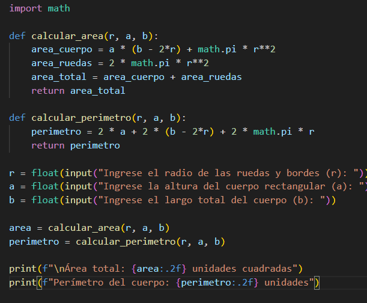
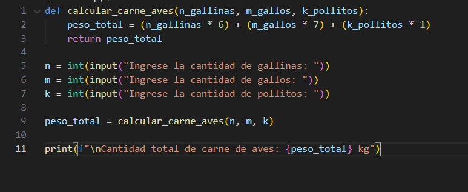
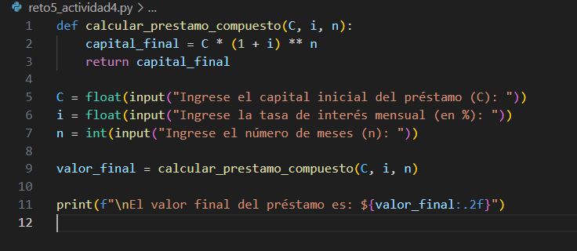
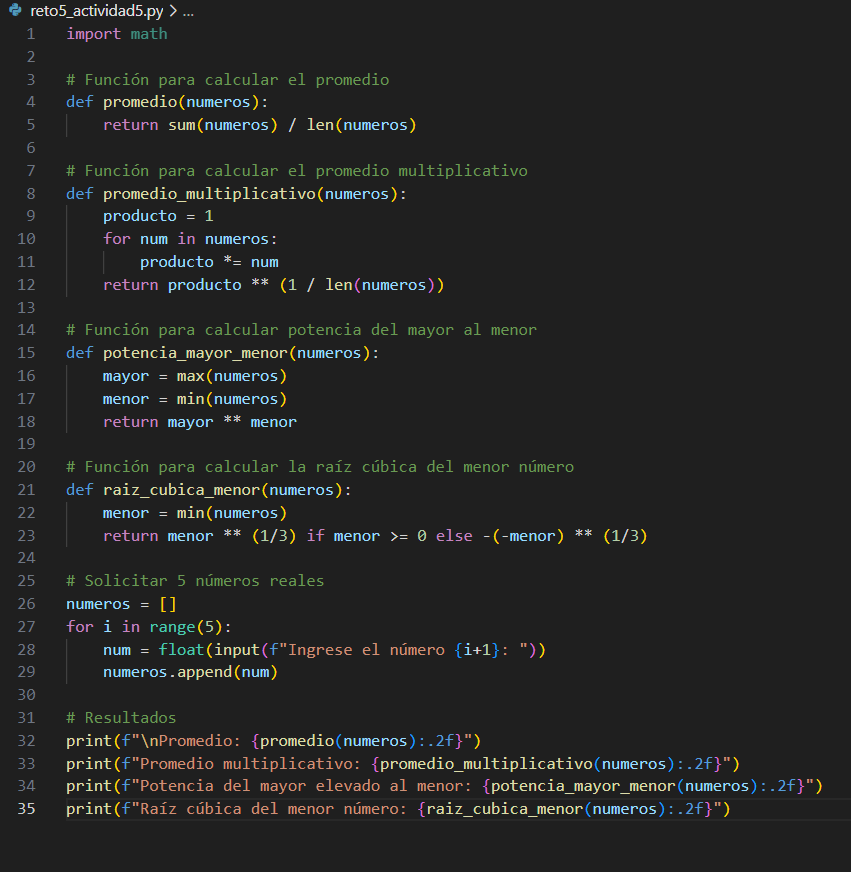

# Reto 5#

# Actividad 1 #

# Actividad 2 #

# Actividad 3 #

# Actividad 4 #

# Actividad 5 #


# ¿Qué es pip en python? #
* `pip` es el sistema de gestión de paquetes oficial de Python. Sirve para instalar, actualizar o eliminar bibliotecas desde el         repositorio oficial llamado PyPI (Python Package Index).

# ¿Como funciona pip? #
*  `pip` se puede utilizar desde la terminal o la consola de comandos
* comandos basicos de uso:

```bash
pip install nombre_paquete          # Instalar un paquete
pip uninstall nombre_paquete        # Desinstalar un paquete
pip list                            # Ver todos los paquetes instalados
pip show nombre_paquete             # Ver información de un paquete
pip freeze                          # Ver paquetes y versiones exactas
```
# modulos populares #
| Módulo           | Descripción                                   | Instalación                  |
| ---------------- | --------------------------------------------- | ---------------------------- |
| `numpy`          | Operaciones matemáticas y manejo de arrays    | `pip install numpy`          |
| `pandas`         | Análisis y manipulación de datos tabulares    | `pip install pandas`         |
| `matplotlib`     | Gráficas y visualizaciones                    | `pip install matplotlib`     |
| `requests`       | Hacer peticiones HTTP                         | `pip install requests`       |
| `flask`          | Microframework web                            | `pip install flask`          |
| `django`         | Framework web completo                        | `pip install django`         |
| `pygame`         | Desarrollo de videojuegos en 2D               | `pip install pygame`         |
| `openpyxl`       | Leer y escribir archivos de Excel (`.xlsx`)   | `pip install openpyxl`       |
| `beautifulsoup4` | Scraping (extraer información de páginas web) | `pip install beautifulsoup4` |
| `scikit-learn`   | Algoritmos de machine learning                | `pip install scikit-learn`   |
